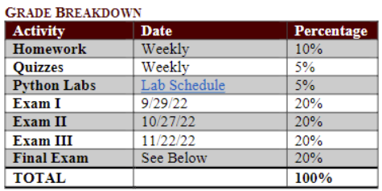
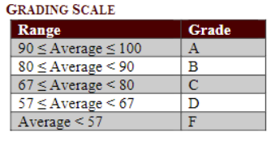

syllabus stuff:

- no calculators on tests of quizzes but might be used on homework

- cannot discuss grades over email of phone

- 
  
  - quizzes are in recitation

- 

- given one week to appeal test inaccuracies

- labs are in groups
  
  - assigned groups based on proximity

- three common exams during the semester taken by all math 151 students
  
  - bring student id

- final exam grade will replace lowest midterm grade if higher than lowest midterm grade

- excused absences student rule 7 same for make up exams
  
  - always contact cantu about missed assignments or exams
  
  - 
