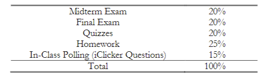
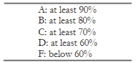

Syllabus:

- all course material is on canvas
  
  - schedule, notes, announcements, etc
  
  - use netid to log in
  
  - 
  
  - 

- For full credit, reason, units and work is required

- no bonus for class attendance, attendance is required

- late work and excused absences require a good reason
  
  - student rule #7

Important info:

- **practice** is important

- pay attention and participate in class
  
  - every class counts

- seek help when needed

- need a non internet enabled scientific calculator
  
  - graphing ok

- HOMEWORK IS A LARGE PART OF GRADE

- take home exams

- DO NOT MISS EXAMS

- lecture recordings are on canvas

- homework is graded on accuracy

- exams are based on lectures
  
  - LECTURES ARE IMPORTANT

- all homework is on cengage

- schedule on canvas includes dates, topics, assignments, assessments, and annoucements
